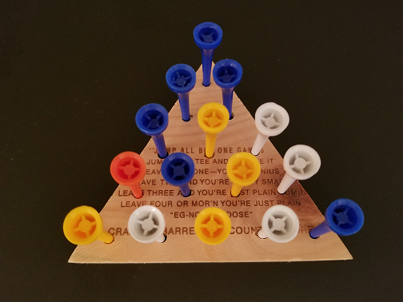
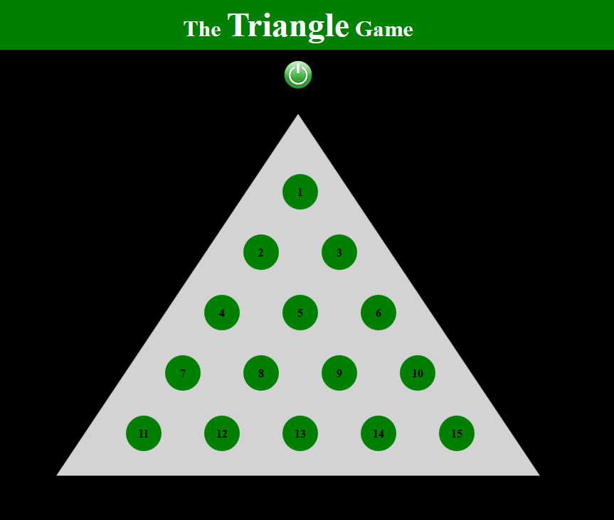

# TriangleGame Web App

## Synopsis

Name:  Triangle Game

This is a web game application.

It is based on a real game board from "Cracker Barrel Old Country Store" given to
 me by a colleague on a business trip.  I loved the game but kept losing pieces in the car and on the plane.  So, I decided to replicate the game electronically.  Below are pictures of the "real game"  and the current web game.

 
 

 <kbd></kbd>
 <kbd></kbd>

 

## Code Description

There is only 1 html screen - the Triangle screen built with html and css.  Javascript is used for the logic removing pieces from the triangle game board.

## Motivation

This is my first web application using technologies html, css, and javascript.

## Installation

Project can be downloaded from GitHub.  
https://github.com/hillc255/TriangleGame

## API Reference

## Contributors

Claudia Hill designed and developed this project.

## License

Only to be used for educational purposes.
